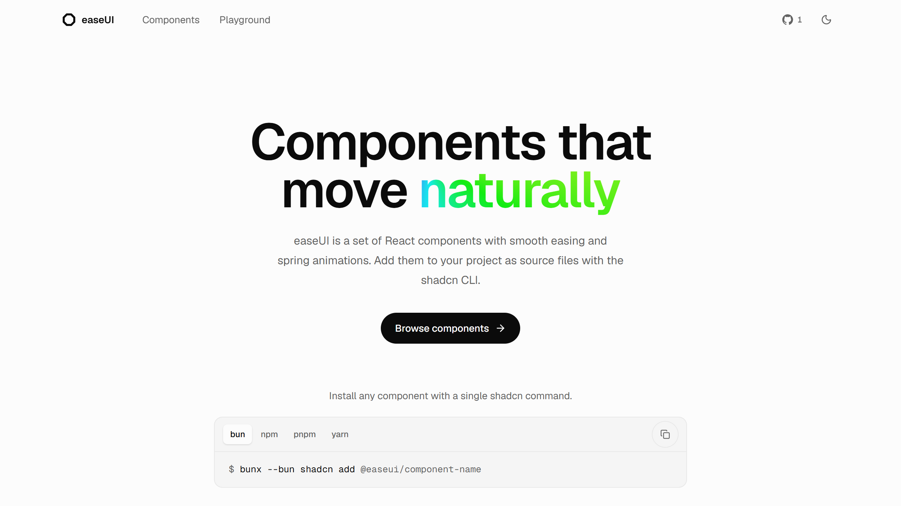

<div align="center">

<a href="https://easeui.dev">
  <picture>
    <source media="(prefers-color-scheme: dark)" srcset=".github/assets/hero-dark.png" />
    
  </picture>
</a>

<h1>easeUI</h1>

<p><strong>React components that move naturally.</strong><br />
Quick, quiet motion you install as source files with the shadcn CLI.</p>

<p>
  <a href="https://easeui.dev/components/motion"></a>
  <a href="LICENSE"></a>
  
  
</p>

<p>
  <a href="https://easeui.dev"><strong>Website</strong></a> &nbsp;·&nbsp;
  <a href="https://easeui.dev/components/motion"><strong>Components</strong></a> &nbsp;·&nbsp;
  <a href="https://easeui.dev/components/agents"><strong>Agents</strong></a> &nbsp;·&nbsp;
  <a href="https://easeui.dev/playground"><strong>Playground</strong></a>
</p>

</div>

<br />

## Why easeUI

Most animation libraries make interfaces feel busy. easeUI goes the other way. Every component is tuned so motion confirms what you did and then gets out of the way.

- **Fast.** Interface motion lands between 100 and 300ms, and exits are quicker than entrances.
- **Honest.** Animations use transform and opacity, ease out, and never bounce in product UI.
- **Calm.** Nothing scales on hover, presses settle at 0.97, and state changes crossfade instead of snapping.
- **Accessible.** Keyboard support and screen reader labels come built in, and motion turns off when the system asks for reduced motion.
- **Yours.** Components install as plain TypeScript files, so you can read and change every line.

## Components

Two categories, growing on their own schedule:

- **[Components](https://easeui.dev/components/motion)**: buttons, inputs, overlays, and feedback. Things like a command palette, an OTP input, a number ticker, tabs, toasts, and menus.
- **[Agents](https://easeui.dev/components/agents)**: pieces for AI interfaces, such as a message bubble, streaming loading states, and a task list.

Every component page has a live preview, the full source, manual install steps, and an API reference. This file doesn't keep its own list, since one more component would make it stale again the same day; browse the current set at [easeui.dev](https://easeui.dev).

## Getting started

easeUI works in any React project that uses Tailwind CSS 4 and the shadcn CLI.

**1. Set up shadcn** if your project does not use it yet.

```bash
npx shadcn@latest init
```

**2. Add a component** straight from its registry URL.

```bash
npx shadcn@latest add https://easeui.dev/r/toast.json
```

Or register easeUI once in `components.json` and add components by name.

```json
{
  "registries": {
    "@easeui": "https://easeui.dev/r/{name}.json"
  }
}
```

```bash
npx shadcn@latest add @easeui/toast
```

**3. Use it.**

```tsx
import { Toaster, toast } from "@/components/motion/toast";

export default function App() {
  return (
    <>
      <button onClick={() => toast.success("Changes saved")}>Save</button>
      <Toaster />
    </>
  );
}
```

## Develop locally

easeUI is built with Next.js 16, React 19, Tailwind CSS 4, and [Bun](https://bun.sh).

```bash
git clone https://github.com/rjcuff/easeui.git
cd easeui
bun install
bun run dev
```

The site runs at http://localhost:3000.

| Script | What it does |
| --- | --- |
| `bun run dev` | Starts the dev server |
| `bun run build` | Builds for production |
| `bun run typecheck` | Checks types |
| `bun run lint` | Lints with Biome |
| `bun run lint:shadcn` | Lints components against shadcn registry rules |
| `bun run test` | Runs unit tests |
| `bun run check:registry` | Validates every registry entry, date, and source file |
| `bun run check` | Runs typecheck, lint, both linters, and the registry check together |

### Project layout

```
app/                  Routes, pages, and registry endpoints
components/motion/    The installable components
components/previews/  Live previews shown on the site
components/app/       Site chrome, docs UI, and the playground
lib/registry.ts       The component catalog
lib/ease.ts           Shared motion tokens
```

### Adding a component

1. Add the source file to `components/motion/`.
2. Add a preview to `components/previews/motion/` and register it in `components/previews/index.tsx`.
3. Add an entry to `lib/registry.ts` and its dates to `lib/component-dates.ts`.
4. Run `bun run check`.

## Contributing

Issues and pull requests are welcome. Read [CONTRIBUTING.md](CONTRIBUTING.md) before you start.

## License

Released under the [MIT License](LICENSE). Made by [Ryan](https://x.com/ryancuff_).
