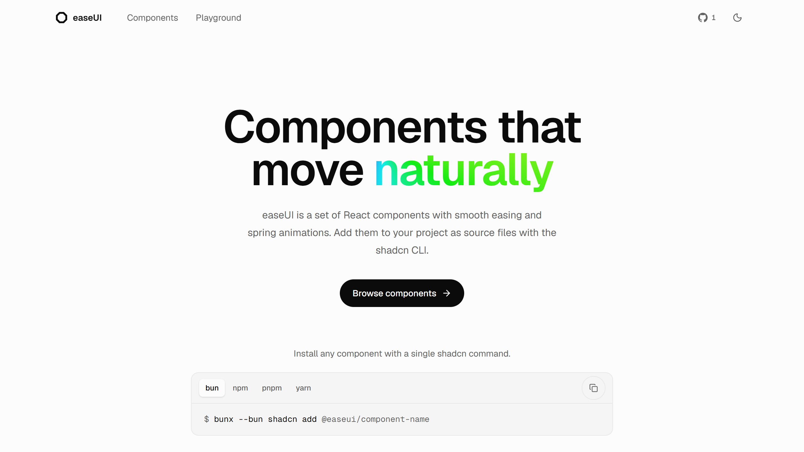
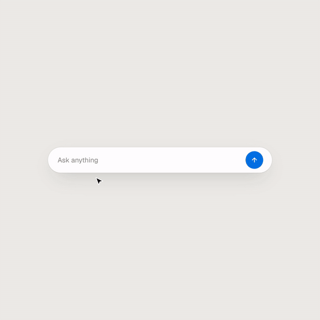

<div align="center">

<a href="https://easeui.dev">
  <picture>
    <source media="(prefers-color-scheme: dark)" srcset=".github/assets/hero-dark.png" />
    
  </picture>
</a>

<h1>easeUI</h1>

<p><strong>React components that move naturally.</strong><br />
Quick, quiet motion you install as source files with the shadcn CLI.</p>

<p>
  <a href="https://easeui.dev/components/motion"></a>
  <a href="LICENSE"></a>
  
  
  <a href="https://ui.shadcn.com/docs/directory"></a>
</p>

<p>
  <a href="https://easeui.dev"><strong>Website</strong></a> &nbsp;·&nbsp;
  <a href="https://easeui.dev/components/motion"><strong>Components</strong></a> &nbsp;·&nbsp;
  <a href="https://easeui.dev/components/agents"><strong>Agents</strong></a> &nbsp;·&nbsp;
  <a href="https://easeui.dev/playground"><strong>Playground</strong></a> &nbsp;·&nbsp;
  <a href="https://pro.easeui.dev"><strong>easeUI Pro</strong></a>
</p>

</div>

<br />

## Contents

- [Why easeUI](#why-easeui)
- [What's inside](#whats-inside)
- [Getting started](#getting-started)
- [Use it with your coding agent](#use-it-with-your-coding-agent)
- [easeUI Pro](#easeui-pro)
- [Develop locally](#develop-locally)
- [Contributing](#contributing)
- [License](#license)

## Why easeUI

Most animation libraries make interfaces feel busy. easeUI goes the other way. Every component is tuned so motion confirms what you did and then gets out of the way.

- **Fast.** Interface motion lands between 100 and 300ms, and exits are quicker than entrances.
- **Honest.** Animations use transform and opacity, ease out, and never bounce in product UI.
- **Calm.** Nothing scales on hover, presses settle at 0.97, and state changes crossfade instead of snapping.
- **Accessible.** Keyboard support and screen reader labels come built in, and motion turns off when the system asks for reduced motion.
- **Yours.** Components install as plain TypeScript files, so you can read and change every line.

## What's inside

Two categories, both free and MIT licensed.

| Category | What you get |
| --- | --- |
| **[Components](https://easeui.dev/components/motion)** | Buttons, inputs and overlays, plus feedback like toasts and alerts. Includes a command palette, OTP input, number ticker, tabs, drawer, stepper, rating, tag input and avatar group. |
| **[Agents](https://easeui.dev/components/agents)** | Pieces for AI interfaces. A message bubble, streaming text and responses, loading states, a prompt input, tool approval and a task list. |

Every component page has a live preview, the full source, install steps and an API reference. The site always has the current list, so this file doesn't keep one.

## Getting started

easeUI works in any React project that uses Tailwind CSS 4 and the shadcn CLI.

**1. Set up shadcn** if your project doesn't use it yet.

```bash
npx shadcn@latest init
```

**2. Add a component.** easeUI is in [shadcn's registry directory](https://ui.shadcn.com/docs/directory) under the `@easeui` namespace, so this works with no extra setup.

```bash
npx shadcn@latest add @easeui/toast
```

Installing from the registry URL works the same way.

```bash
npx shadcn@latest add https://easeui.dev/r/toast.json
```

**3. Use it.**

```tsx
import { Toaster, toast } from "@/components/motion/toast";

export default function App() {
  return (
    <>
      <button onClick={() => toast.success("Changes saved")}>Save</button>
      <Toaster />
    </>
  );
}
```

## Use it with your coding agent

Claude Code, Cursor and Codex can find and install easeUI components for you.

Connect the MCP server, so your agent can search the catalog and read each component's props.

```bash
claude mcp add --transport http easeui https://easeui.dev/api/mcp
```

Or add the easeUI skill, which tells your agent to reach for an existing component before writing a new one.

```bash
npx skills add rjcuff/easeui --skill easeui
```

The full guide, including [`llms.txt`](https://easeui.dev/llms.txt), is at [easeui.dev/docs/ai-agents](https://easeui.dev/docs/ai-agents).

## easeUI Pro

<a href="https://pro.easeui.dev">
  
</a>

easeUI is free and stays free. [**easeUI Pro**](https://pro.easeui.dev) is the paid set, built for AI products, with the same motion rules.

- **AI components.** A model picker with real provider logos, streaming messages, tool calls, approval prompts, diff review, voice input and usage meters.
- **Page blocks.** Heroes, pricing walls, dashboards, settings, auth and agent consoles, wired together and ready to drop in.
- **Templates.** Whole apps you download and deploy, like an AI chat app and a personal site.

Everything in Pro installs the same way as easeUI, as source files you own. [See the catalog](https://pro.easeui.dev/components).

## Develop locally

easeUI is built with Next.js 16, React 19, Tailwind CSS 4 and [Bun](https://bun.sh).

```bash
git clone https://github.com/rjcuff/easeui.git
cd easeui
bun install
bun run dev
```

The site runs at http://localhost:3000.

| Script | What it does |
| --- | --- |
| `bun run dev` | Starts the dev server |
| `bun run build` | Builds for production |
| `bun run typecheck` | Checks types |
| `bun run lint` | Lints with Biome |
| `bun run lint:shadcn` | Lints components against shadcn registry rules |
| `bun run test` | Runs unit tests |
| `bun run check:registry` | Validates every registry entry, date and source file |
| `bun run check` | Runs typecheck, both linters and the registry check together |

### Project layout

```
app/                  Routes, pages and registry endpoints
components/motion/    The installable components
components/previews/  Live previews shown on the site
components/app/       Site chrome, docs UI and the playground
lib/registry.ts       The component catalog
lib/ease.ts           Shared motion tokens
```

### Adding a component

1. Add the source file to `components/motion/`.
2. Add a preview to `components/previews/<category>/` and register it in `components/previews/index.tsx`.
3. Add an entry to `lib/registry.ts` and its dates to `lib/component-dates.ts`.
4. Run `bun run check`.

[CONTRIBUTING.md](CONTRIBUTING.md) has the motion and accessibility rules every component follows.

## Contributing

Issues and pull requests are welcome. Read [CONTRIBUTING.md](CONTRIBUTING.md) before you start.

## License

Released under the [MIT License](LICENSE). Made by [Ryan](https://x.com/ryancuff_).
